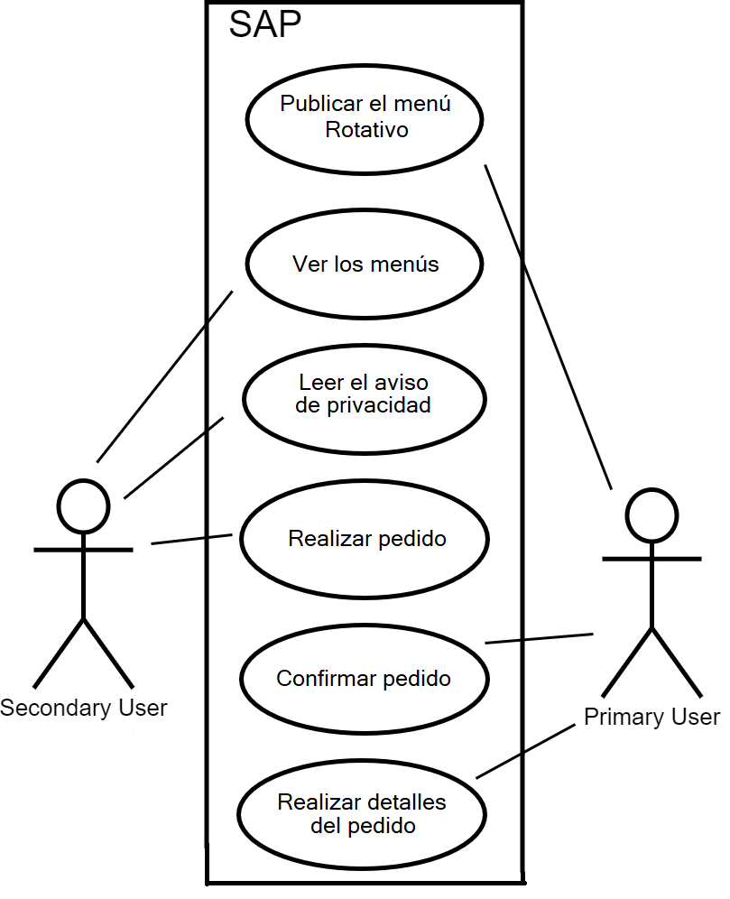

# Diagrama de casos de usos

Se realizó un diagrama de casos de uso en base a la tabla de especificaciones que se elaboró anteriormente. Teniendo las tablas se pudo visualizar de manera más clara la manera en como se realizaría el diagrama y bajo los estándares intercionales, se procedió a planificar y desarrollar el artefacto. El resultado se puede observar aquí: 
