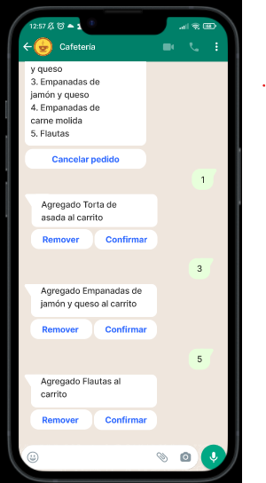
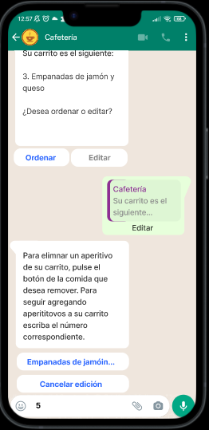

# Interfaz de media fidelidad

 

[Click aquí para probar prototipo en Figma](https://www.figma.com/proto/xHLsKEsCN8c3sHgmMgvTBe/Untitled?node-id=20%3A36&scaling=scale-down&page-id=0%3A1&starting-point-node-id=20%3A36&show-proto-sidebar=1)

## [Validación de requerimientos](Validadación%20de%20requerimientos.pdf)